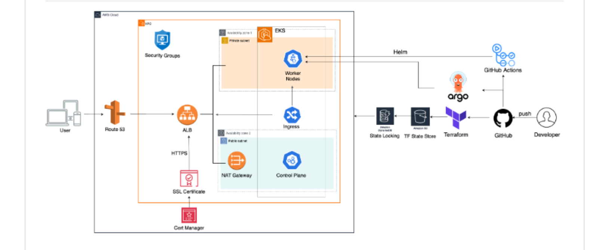
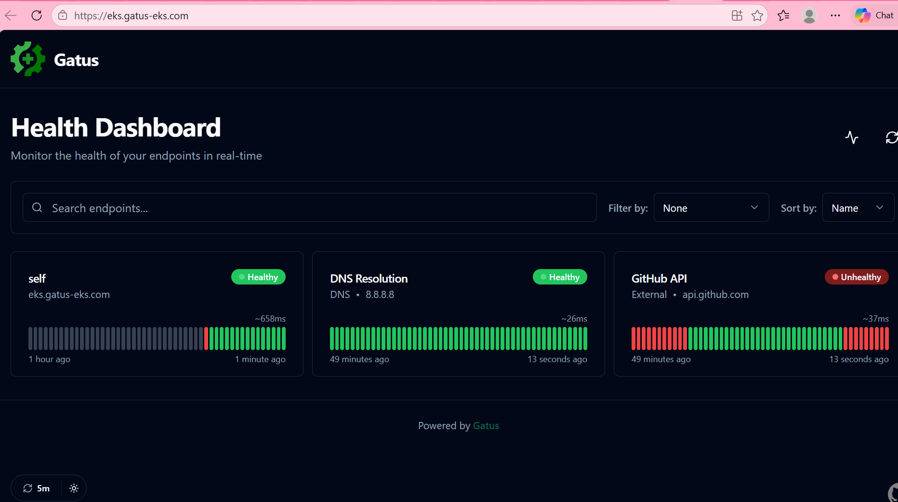
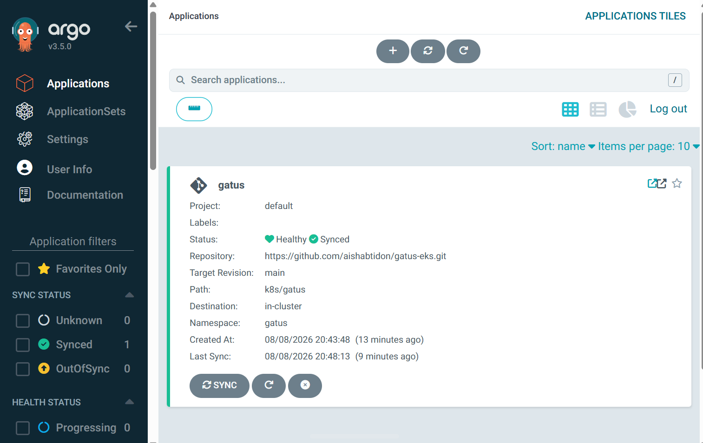
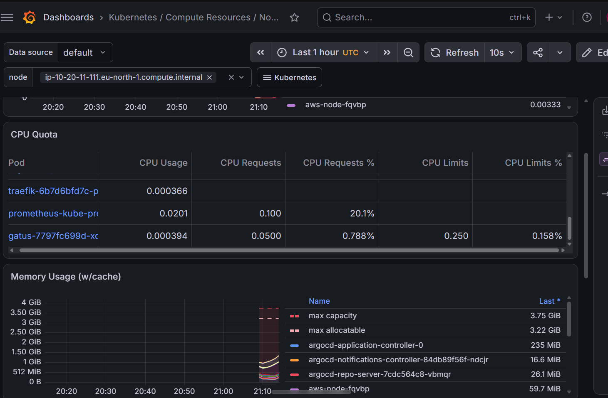
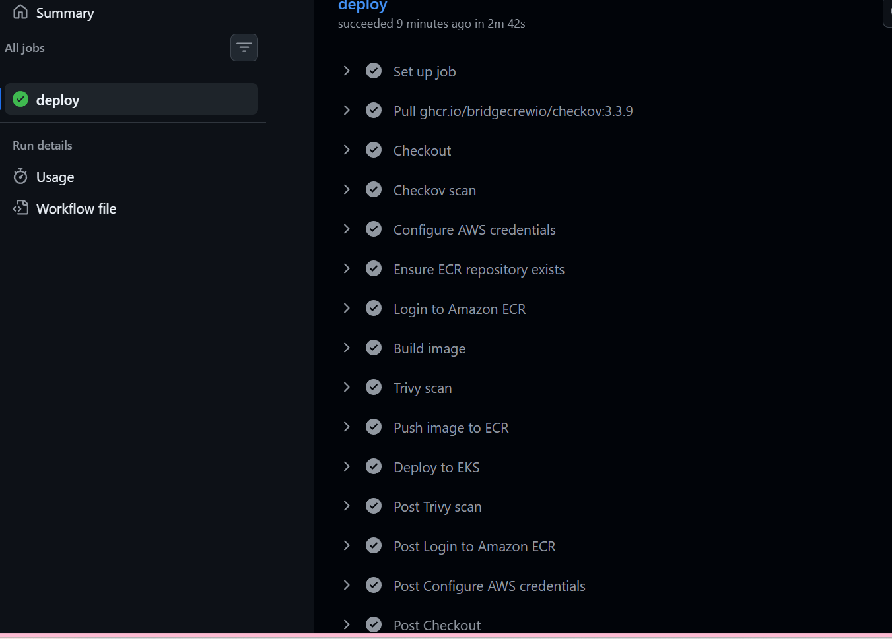
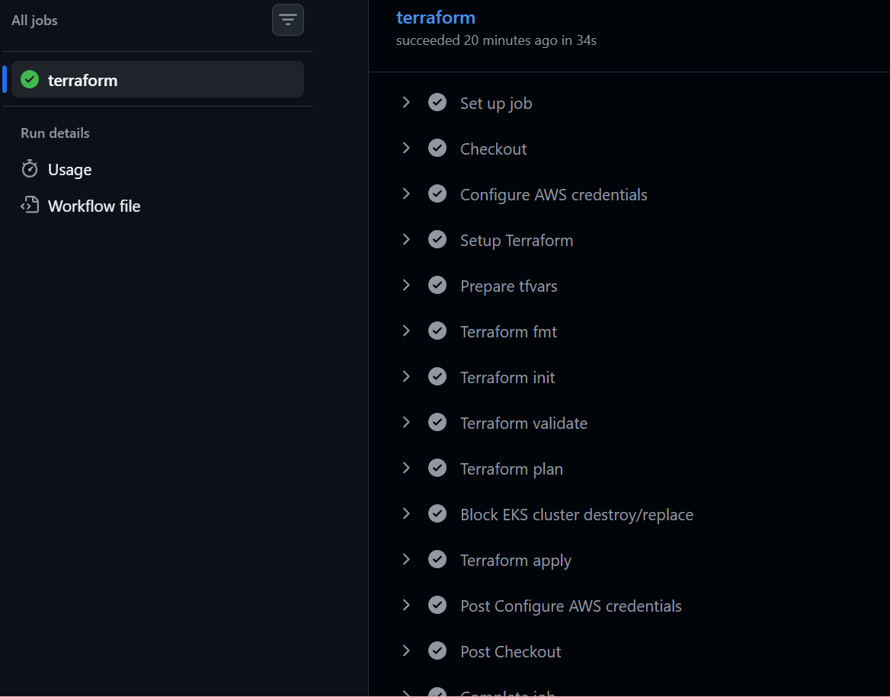

# Gatus on Amazon EKS

A production-style deployment of [Gatus](https://github.com/TwiN/gatus) on Amazon EKS, with infrastructure defined in Terraform and deployment automated via GitHub Actions and ArgoCD. The setup uses a multi-AZ VPC, Traefik with an AWS Network Load Balancer, cert-manager for HTTPS (Let’s Encrypt), ExternalDNS for Route 53, GitOps with ArgoCD, and Prometheus/Grafana for monitoring.

**Live URL:** [https://eks.gatus-eks.com](https://eks.gatus-eks.com)

## Table of Contents

- [Requirements](#requirements)
- [Architecture Diagram](#architecture-diagram)
- [Features](#features)
- [Run Locally](#run-locally)
- [Deploying to AWS](#deploying-to-aws)
- [Reproducing the Setup](#reproducing-the-setup)
- [Deployment Visuals](#deployment-visuals)

## Requirements

Before running or deploying, ensure you have:

| Requirement | Purpose |
|---|---|
| Docker | Build and run the Gatus image locally and in CI |
| Terraform 1.6 or later | Provision and manage AWS infrastructure |
| AWS CLI | Configure credentials; optional for local deploy and debugging |
| kubectl | Interact with the EKS cluster |
| Helm 3 | Install Traefik, ExternalDNS, cert-manager, monitoring |
| Git | Clone the repo and push to trigger workflows |
| GitHub account | Host the repo and run GitHub Actions |
| AWS account | Run EKS, ECR, Route 53, S3, DynamoDB, IAM |

For CI/CD you will also need:

- An **S3 bucket** and **DynamoDB table** for Terraform state (create these before the first apply).
- A **Route 53 hosted zone** for your domain (`gatus-eks.com`) so ExternalDNS and cert-manager (DNS-01) can manage records and certificates.
- GitHub Actions secret: **`AWS_ROLE_ARN`** for OIDC assume-role (Terraform, Docker build/push, destroy).

## Architecture Diagram



## Features

- Gatus health dashboard running on **Amazon EKS**
- Multi-AZ networking (**eu-north-1a**, **eu-north-1b**) with public subnets for load balancers and private subnets for worker nodes
- **HTTPS** via cert-manager + Let’s Encrypt (DNS-01) and Traefik Ingress
- **AWS NLB** in front of Traefik (Ingress controller)
- **ExternalDNS** syncing Ingress hostnames to Route 53
- **GitOps** with ArgoCD (auto-sync / self-heal from `k8s/gatus`)
- **CI/CD**:
  - Pipeline 1 — Terraform fmt / init / validate / plan / apply (OIDC)
  - Pipeline 2 — Checkov, Docker build, Trivy, push to ECR, update image tag in Git for ArgoCD
  - Destroy — manual `workflow_dispatch` only
- Modular Terraform under `infra/modules/` (`vpc`, `eks`) with IAM, security groups, and IRSA
- Terraform state in **S3** with **DynamoDB** locking
- **Prometheus + Grafana** (`kube-prometheus-stack`) for cluster/app metrics and dashboards

## Run Locally

From the Gatus app directory:

```bash
cd gatus
docker build -t gatus:local .
docker run -p 8080:8080 --name gatus gatus:local
```

Then open [http://localhost:8080](http://localhost:8080) in your browser.

## Deploying to AWS

### 1. Configure Terraform

Edit `infra/terraform.tfvars` (or copy from `infra/terraform.tfvars.example`) for region, cluster name, VPC CIDRs, and node sizing. Ensure the S3 bucket and DynamoDB table for state exist and match `infra/backend.tf`.

### 2. Apply infrastructure (first time or from your machine)

```bash
cd infra
terraform init -input=false
terraform plan -input=false -out=tfplan
terraform apply -input=false tfplan
```

Configure kubectl:

```bash
aws eks update-kubeconfig --name gatus-eks --region eu-north-1
```

### 3. Platform components (Helm / manifests)

Install on the cluster (order matters):

1. **Traefik** — `k8s/helm/traefik/values-ingress.yaml`
2. **ExternalDNS** — `k8s/helm/external-dns/values-dns.yaml`
3. **cert-manager** + ClusterIssuer / Certificate — `k8s/cert-manager/`
4. **ArgoCD** + Application — `k8s/argocd/application.yaml` (syncs `k8s/gatus`)
5. **Monitoring** — `k8s/helm/monitoring/values-prometheus.yaml` (`kube-prometheus-stack`)

App URL after DNS/TLS: **https://eks.gatus-eks.com**

### 4. GitHub Actions

Secret (Settings → Secrets and variables → Actions):

| Secret | Purpose |
|---|---|
| `AWS_ROLE_ARN` | OIDC role for Pipeline 1, Pipeline 2, and Destroy |

Workflows:

| Workflow | Trigger | What it does |
|---|---|---|
| `terraform.yml` | Push to `infra/**` or manual | Terraform fmt → init → validate → plan → apply |
| `docker-deploy.yml` | Push to `gatus/**` or manual | Checkov → build → Trivy → ECR → commit image tag for ArgoCD |
| `destroy.yml` | Manual only | `terraform destroy` |

### 5. Manual image build and push (optional)

```bash
aws ecr get-login-password --region eu-north-1 \
  | docker login --username AWS --password-stdin <ACCOUNT_ID>.dkr.ecr.eu-north-1.amazonaws.com

docker build -t gatus-app ./gatus
docker tag gatus-app:latest <ACCOUNT_ID>.dkr.ecr.eu-north-1.amazonaws.com/gatus-app:latest
docker push <ACCOUNT_ID>.dkr.ecr.eu-north-1.amazonaws.com/gatus-app:latest
```

Update the image in `k8s/gatus/deployment.yaml` and push so ArgoCD rolls out the new version.

## Reproducing the Setup

1. Clone the repository.
2. Create an S3 bucket and DynamoDB table for Terraform state; align `infra/backend.tf` and `infra/terraform.tfvars`.
3. Ensure a Route 53 hosted zone exists for your domain.
4. Run Terraform apply once to create the EKS cluster, VPC, IAM, and related resources.
5. Create the GitHub OIDC provider / `github-action-gatus` role (or equivalent); add `AWS_ROLE_ARN` to GitHub secrets. Trust policy must allow the GitHub subject format used by Actions (including owner/repo IDs if required).
6. Install Traefik, ExternalDNS, cert-manager, ArgoCD, and the monitoring stack.
7. Apply / sync `k8s/gatus` via ArgoCD (or bootstrap once, then let GitOps take over).
8. Push to `main` to trigger CI; wait for HTTPS and health checks.
9. Access the app at **https://eks.gatus-eks.com**.

## Deployment Visuals

### Live app (HTTPS domain)



### ArgoCD GitOps (Synced / Healthy)



### Monitoring (Prometheus / Grafana)



### CI/CD pipelines

**Pipeline 1 — Terraform**



**Pipeline 2 — Docker, security & deploy**


