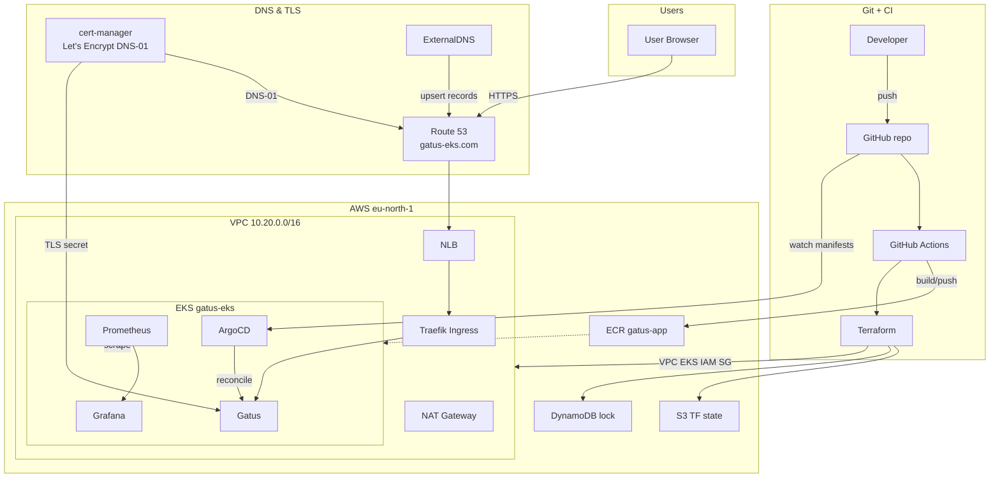

```mermaid
flowchart TB
  subgraph Users
    U[User Browser]
  end

  subgraph DNS["DNS & TLS"]
    R53[Route 53<br/>gatus-eks.com]
    CM[cert-manager<br/>Let's Encrypt DNS-01]
    ED[ExternalDNS]
  end

  subgraph AWS["AWS eu-north-1"]
    subgraph VPC["VPC 10.20.0.0/16"]
      NLB[NLB]
      TR[Traefik Ingress]
      subgraph EKS["EKS gatus-eks"]
        G[Gatus]
        A[ArgoCD]
        P[Prometheus]
        GR[Grafana]
      end
      NAT[NAT Gateway]
    end
    ECR[ECR gatus-app]
    S3[S3 TF state]
    DDB[DynamoDB lock]
  end

  subgraph GitOps["Git + CI"]
    DEV[Developer]
    GH[GitHub repo]
    GHA[GitHub Actions]
    TF[Terraform]
  end

  U -->|HTTPS| R53 --> NLB --> TR --> G
  ED -->|upsert records| R53
  CM -->|DNS-01| R53
  CM -->|TLS secret| G

  DEV -->|push| GH
  GH --> GHA
  GHA -->|build/push| ECR
  GHA --> TF
  TF --> S3
  TF --> DDB
  TF -->|VPC EKS IAM SG| VPC
  GH -->|watch manifests| A -->|reconcile| G
  ECR -.->|pull| EKS
  P -->|scrape| EKS
  P --> GR
```
